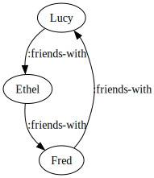

# Labeled Property Graph

A small implementation of a labeled property graph. This
implementation is immutable and does not implement "index-free
adjacency", which means nodes do not store direct pointers to other
nodes and are instead indexed in the graph.

## Status

Toy project; API is subject to change. Please do not use this for
anything real.

See
[simongray/clojure-graph-resources](https://github.com/simongray/clojure-graph-resources)
for a list of more robust Clojure graph libraries.

## Basic usage

Create a graph with nodes and edges.

```clojure
(require '[me.noonian.property-graph :as pg])

(def g
  (let [fred (pg/node {:name "Fred"})
        ethel (pg/node {:name "Ethel"})
        lucy (pg/node {:name "Lucy"})]
    (-> (pg/new-graph)
        (pg/add-nodes [fred ethel lucy])
        (pg/add-edges [(pg/directed-edge fred :friends-with lucy)
                       (pg/directed-edge ethel :friends-with fred)
                       (pg/directed-edge lucy :friends-with ethel)]))))
```

This represents the following graph.



Properties are arbitrary clojure maps.

Edge labels are also arbitrary objects, but the visualization code
assumes they can be safely serialized as a string.

Currenly nodes are only indexed by id. Properties are not indexed.

## API

For functions that take a graph and entities, the entities can either
be a node or edge, or an id.

Functions that do not take a graph argument only accepts node or edge
objects (a graph is required to lookup an entity by id).

Functions that take a graph as a first argument and modify the graph
will return the modified graph.

### Entities

These functions operate on both nodes and edges.

`(id node-or-edge)` - return the id of a node or edge

### Nodes

A node has an `:id` and a map of properties. Nodes are automatically
assigned an id when they are created.

`(node)` - create a new node

`(node properties)` - create a new node with properties

### Edges

When creating edges, `from` and `to` can be either Node's, or node
id's. Label is an arbitrary value.

`(directed-edge from label to)` - create an edge between the node `from` and the node `to`

`(directed-edge from label to properties)` - create the same edge but with properties

`(label edge)` - return replationship label for `edge`

### Graphs

Getting data from a graph:

`(nodes g)` - return list of nodes

`(edges g)` - return list of edges

`(by-id g node-or-edge-id)` - return entity with provided id or `nil`

`(outgoing g node)` - return set of edges from `node` to other nodes

`(incoming g node)` - return set of edges from other nodes to `node`

`(props g edge-or-node)` - return map of properties associated with `edge-or-node`

`(find-ents g predicate)` - returns set of entities for which
`predicate` returns true. Linear time proportional to number of
entities in the graph.

Modifying graphs:

`(new-graph)` - return empty graph

`(add-node g node)` - add `node` to `g`

`(add-edge g edge)` - add `edge` to `g`

By default, you can add edges that reference nodes that have not been
added to the graph yet. This is a convenience if you need to create a
graph and are processing edges and nodes in an indeterminate order.

Binding `*validate-edge-refs*` to true will cause `add-edge` to throw
an exception if called with an edge that references missing nodes.

Bulk operations:

`(add-nodes g nodes)` - add collection of `nodes` to `g`

`(add-edges g edges)` - add collection of `edges` to `g`

Removing and modifying nodes and edges:

`(remove-node g node)` - remove `node` from `g` and any edges that reference `node`

`(remove-edge g edge)` - remove `edge` from `g`

`(update-props g id f)` - updates the props of entity with `id` by
applying the function `f` to the current props for `id`

## Querying graphs

There is the beginning of an experimental query language in the
`me.noonian.property-graph.query` namespace. The language is loosly
inspired by Cypher, Neo4J's query language.

Currently the language only supports traversing graphs by specifying
allowed edge labels, and does not support filtering on node or edge
properties. This language is not at the point of being useful, but it
is helpful in exploring possibilities for querying.

If we wanted a query to get the "friends of friends" in the graph
above, starting at `fred`, it would look something like this.

```clojure
(require '[me.noonian.property-graph.query :as q])

(def fred (pg/find-ents g #(= "Fred" (:name (pg/props g %)))))

(def fof-query
  '[start-nodes :friends-with friends :friends-with friends-of-friends])

(def initial-env
  {'start-nodes #{(:id fred)}})

(q/run-query g fof-query initial-env)
```

Results should look something like this:

```clojure
{start-nodes #{#uuid "a2a19e3a-e446-4e36-84ae-d070d0a2a8c4"},
 friends #{#uuid "4b9e2f19-ffde-4a41-91de-3268ea4407c2"},
 friends-of-friends #{#uuid "bc1a2c8d-7330-48a2-b179-c213a075ca58"}}
```

To get the actual data, you will need to use `pg/by-id` with the graph
and returned ids.

If you specify an underscore (`_`) as a binding symbol it will be
omitted in the results. We could write the following query as:

```clojure
(def fof-query2
  '[start-nodes :friends-with _ :friends-with friends-of-friends])
```

And our output would instead look like:

```clojure
{start-nodes #{#uuid "a2a19e3a-e446-4e36-84ae-d070d0a2a8c4"},
 friends-of-friends #{#uuid "bc1a2c8d-7330-48a2-b179-c213a075ca58"}}
```

Lastly, you may specify a Clojure set of labels instead of an
individual label. Semantically this means traverse any of the labels
in the set.

```clojure
(def friends-of-friends-or-enemies
  '[start-nodes #{:friends-with :enemies-with} _ :friends-with friends-of-enemies-or-friends])
```

This should return the same result for this graph, because there are
no edges labeled `:enemies-with`.

## Visualizing graphs

```clojure
(require '[me.noonian.property-graph.dot :as pg.dot])

(spit "clojure-friends.dot" (pg.dot/graph->dot g {:label-prop :name}))
```

`(graph->dot g)` - return a string of GraphViz `dot` language representing `g`

If you have [Graphviz](https://graphviz.org/) installed (`brew install graphviz` on OSX), you
can generate an image of a graph using the `dot` command.

For example, after writing the graph to `clojure-friends.dot`

```sh
dot -Tsvg clojure-friends.dot > clojure-friends.svg
```

## Developing

Run unit tests with kaocha.

`clojure -X:test`

## Logging configuration

Uses [clojure/tools.logging](https://github.com/clojure/tools.logging)
for logging.

This library does not ship with a logging implementation. You will
need to include the appropriate dependencies and logging configuration
for your applications logging setup.

For local development, the `:dev` profile includes a dependency on
logback classic and a minimal logging config.


## Copyright & License

The MIT License (MIT)

Copyright © 2023 Jedidiah T Clinger

Permission is hereby granted, free of charge, to any person obtaining
a copy of this software and associated documentation files (the
"Software"), to deal in the Software without restriction, including
without limitation the rights to use, copy, modify, merge, publish,
distribute, sublicense, and/or sell copies of the Software, and to
permit persons to whom the Software is furnished to do so, subject to
the following conditions:

The above copyright notice and this permission notice shall be
included in all copies or substantial portions of the Software.

THE SOFTWARE IS PROVIDED "AS IS", WITHOUT WARRANTY OF ANY KIND,
EXPRESS OR IMPLIED, INCLUDING BUT NOT LIMITED TO THE WARRANTIES OF
MERCHANTABILITY, FITNESS FOR A PARTICULAR PURPOSE AND
NONINFRINGEMENT. IN NO EVENT SHALL THE AUTHORS OR COPYRIGHT HOLDERS BE
LIABLE FOR ANY CLAIM, DAMAGES OR OTHER LIABILITY, WHETHER IN AN ACTION
OF CONTRACT, TORT OR OTHERWISE, ARISING FROM, OUT OF OR IN CONNECTION
WITH THE SOFTWARE OR THE USE OR OTHER DEALINGS IN THE SOFTWARE.
